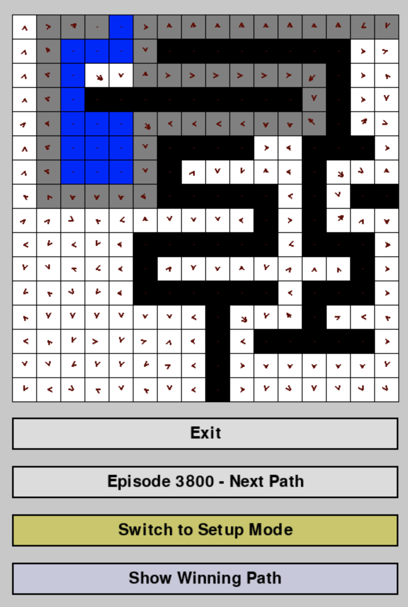
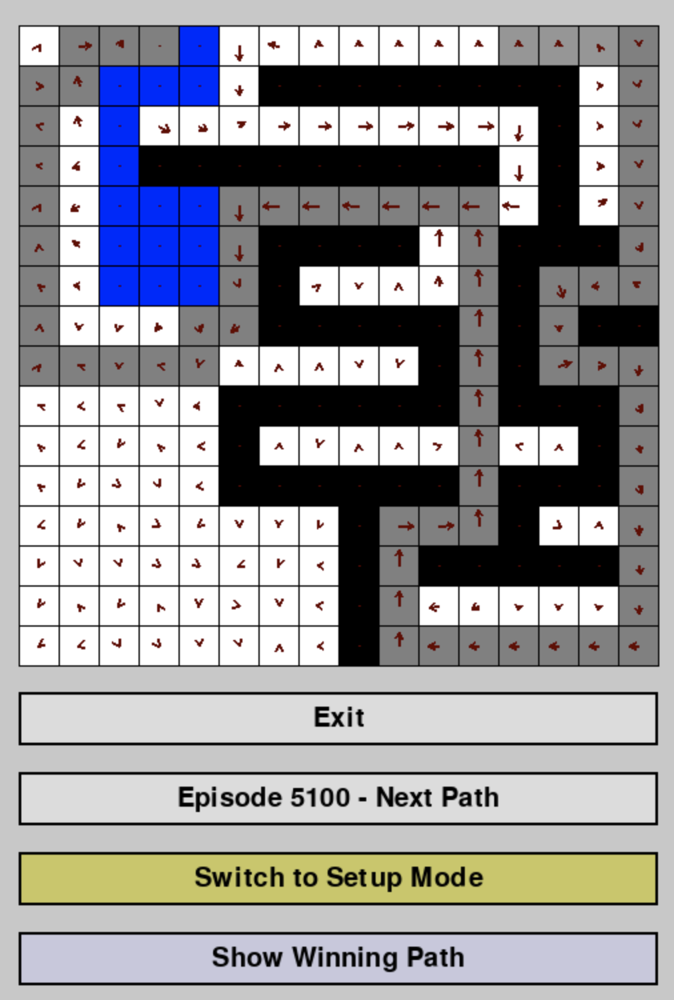
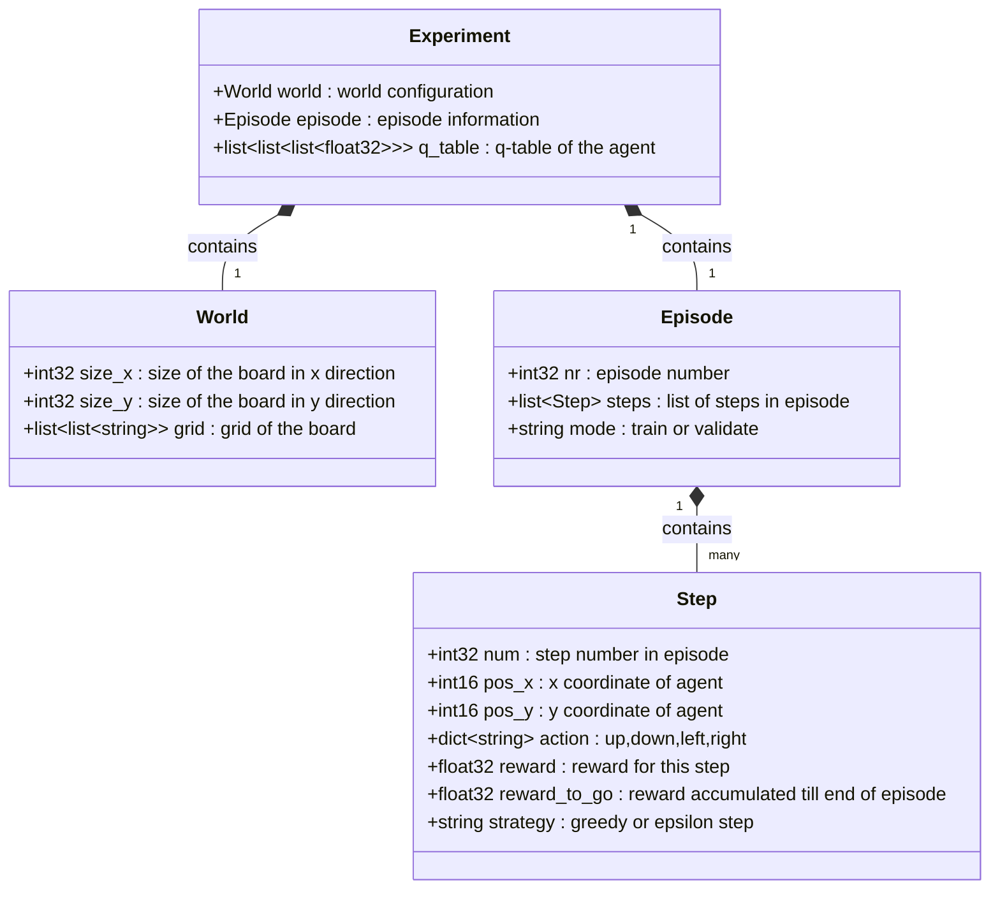

# RL Experiments - Reinforcement Learning - Maze Navigation

## Q-Learning and SARSA
A reinforcement learning project that trains agents to navigate through a maze using Q-Learning and SARSA algorithms. The project includes a visual board editor for creating custom mazes and a viewer for visualizing the learned Q-values and optimal paths.

**SARSA (State-Action-Reward-State-Action)**:
```
Q(s,a) = Q(s,a) + α[R + γQ(s',a') - Q(s,a)]
```
Updates Q-values based on the action actually taken (a' = a chosen by policy =on-policy), where α is the Learning rage, R is the actual reward and  γ is the discount factor.

**Q-Learning**:
```
Q(s,a) = Q(s,a) + α[R + γ max_a' Q(s',a') - Q(s,a)]
```
Updates Q-values based on the maximum Q-value of the optimal action (which is not the action taken by the policy, but the best action max_a' Q(s',a') = off-policy), where α is the Learning rage, R is the actual reward and  γ is the discount factor.


<table>
  <tr>
    <td>Q-Learning after 3800 steps&nbsp;</td>
    <td>SARSA after 5100 steps&nbsp;</td>
  </tr>
</table>
The experiments shows that SARSA is more cautious and Q-Learning is more bold. We see that SARSA is more stable avoiding obstacles with a higher penalty anand Q-Learning is more volatile and converges faster. In the example you see here the blue represents an obstacle with a high penalty (-100) black represents a wall (agent cannot move through) and white represents a free cell (navigable). The arrows in each cell indicate the learned policy direction based on Q-values.

## Maze

The labyrinth is a 16×16 grid where:
- **Red cells** = Start position
- **Green cells** = Goal position
- **Blue cells** = Invalid/water cells (high penalty, episode ends)
- **Black cells** = Walls (agent cannot move through)
- **White cells** = Free cells (navigable)
- **Gray cells** = Visited cells (path visualization)

The arrows in each cell indicate the learned policy direction based on Q-values using softmax normalization.

## Board Editor

- **Two RL Algorithms**: SARSA (on-policy) and Q-Learning (off-policy)
- **Interactive Board Editor**: Create and modify custom maze layouts
- **Q-Value Visualization**: View learned policy as directional arrows on each cell
- **Episode Replay**: Navigate through saved training episodes
- **Parquet Persistence**: Store experiment data including Q-tables, paths, and rewards
- **Configurable Training**: Adjust hyperparameters via YAML configuration

## Installation

```bash
# Create virtual environment
python -m venv .venv
source .venv/bin/activate  # On Windows: .venv\Scripts\activate

# Install dependencies
pip install -r requirements.txt
```

## Usage

### 1. Train the Agent

```bash
python agent.py
```

This will:
- Load the board configuration from `experiments/board.npy`
- Train the agent for the specified number of episodes
- Save Q-tables and optimal paths every 100 episodes
- Store experiment data in Parquet format

### 2. View and Edit the Board

```bash
python board.py
```

### 3. Configure Training Parameters

Edit `config.yaml` to adjust:

```yaml
agent:
  type: sarsa          # or "q-learning"
  alpha: 0.05          # Learning rate
  gamma: 0.99          # Discount factor
  epsilon: 0.5         # Initial exploration rate
  epsilon_decay: 0.9995
  epsilon_min: 0.01

training:
  num_episodes: 10000
  max_steps_per_episode: 100
  validate_interval: 100

rewards:
  default: -1         # 'normal' step 
  invalid: -100       # step into water or invalid cell
  wall: -10           # step into wall  
```

## Data Persistence

Training results are saved in two formats (TODO: cleanup, switch to parquet):

1. **NumPy files** (`experiments/`)
   - `board_with_path_XXXXXX.npy` - Board state with optimal path
   - `q_table_XXXXXX.npy` - Learned Q-table for each episode

2. **Parquet files** (`experiments/`)
   - `experiment_XXXXXX.parquet` - Complete experiment data including:
     - Episode metadata
     - Q-table (3D array: rows × cols × actions)
     - Detailed step information with rewards-to-go

Note: parquet files are good for analysis, store data in a columnar format and are compact. They allow queries from duckdb in sql- which can be used to analyze the data as demonstrated in the `analysis.ipynb` notebook.

### Parquet File Schema


**Storage Location:** `experiments/experiment_XXXXXX.parquet` (per validation episode)


### View Notebook

You can view the Jupyter notebook directly:
- **[View inspect.ipynb](inspect.ipynb)** - Click to view the notebook


# Parquet Schema 

## Schema Diagram


Each step in training and validation is stored as a row in the parquet file. The strategy is either 'train' or 'validate'.


