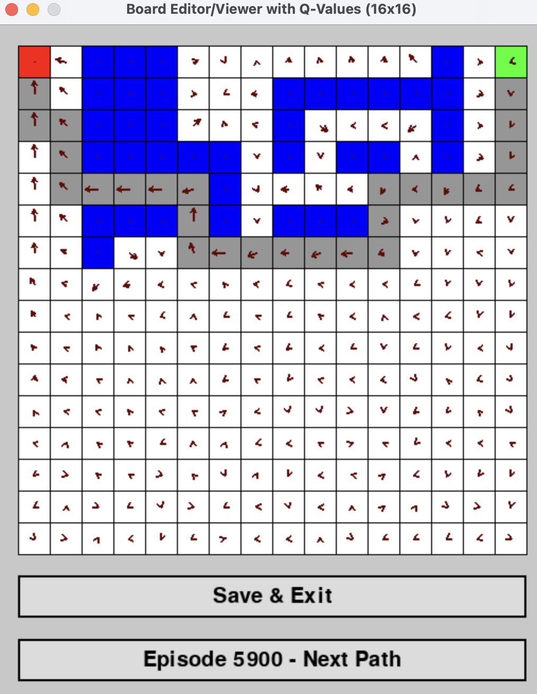
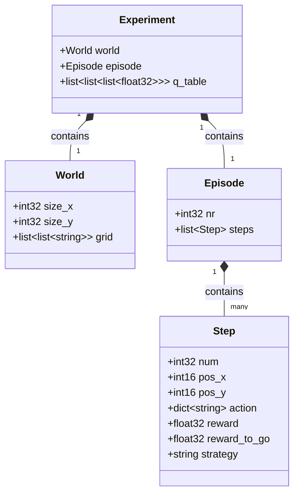
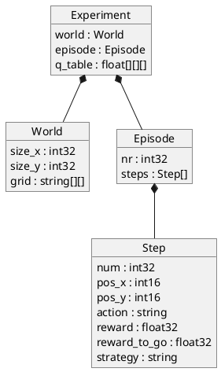

# RL Experiments - Reinforcement Learning Pathfinding

A reinforcement learning project that trains agents to navigate through a maze using Q-Learning and SARSA algorithms. The project includes a visual board editor for creating custom mazes and a viewer for visualizing the learned Q-values and optimal paths.

## The Labyrinth



The labyrinth is a 16×16 grid where:
- **Red cells** = Start position
- **Green cells** = Goal position
- **Blue cells** = Invalid/water cells (high penalty, episode ends)
- **Black cells** = Walls (agent cannot move through)
- **White cells** = Free cells (navigable)
- **Gray cells** = Visited cells (path visualization)

The arrows in each cell indicate the learned policy direction based on Q-values using softmax normalization.

## Features

- **Two RL Algorithms**: SARSA (on-policy) and Q-Learning (off-policy)
- **Interactive Board Editor**: Create and modify custom maze layouts
- **Q-Value Visualization**: View learned policy as directional arrows on each cell
- **Episode Replay**: Navigate through saved training episodes
- **Parquet Persistence**: Store experiment data including Q-tables, paths, and rewards
- **Configurable Training**: Adjust hyperparameters via YAML configuration

## Project Structure

```
rl-experiments/
├── agent.py              # RL agent implementations (SARSA, Q-Learning)
├── board.py              # Pygame-based board editor and visualizer
├── config.py             # Configuration data models and enums
├── config.yaml           # Training hyperparameters and settings
├── persistence.py        # Data loading/saving (NumPy, Parquet)
├── experiments/          # Saved episodes with Q-tables and paths
└── doc/                  # Documentation and images
```

## Installation

```bash
# Create virtual environment
python -m venv .venv
source .venv/bin/activate  # On Windows: .venv\Scripts\activate

# Install dependencies
pip install numpy pygame pydantic pyyaml pyarrow pandas
```

## Usage

### 1. Train the Agent

```bash
python agent.py
```

This will:
- Load the board configuration from `experiments/board.npy`
- Train the agent for the specified number of episodes
- Save Q-tables and optimal paths every 100 episodes
- Store experiment data in Parquet format

### 2. View and Edit the Board

```bash
python board.py
```

This opens the board editor/viewer where you can:
- **Left-click cells** to cycle through cell types (free, wall, invalid, start, goal)
- **Click "Next Path"** to navigate through saved training episodes
- **Click "Save & Exit"** to save board modifications
- **View Q-value arrows** overlaid on each cell

### 3. Configure Training Parameters

Edit `config.yaml` to adjust:

```yaml
agent:
  type: sarsa          # or "q-learning"
  alpha: 0.05          # Learning rate
  gamma: 0.99          # Discount factor
  epsilon: 0.5         # Initial exploration rate
  epsilon_decay: 0.9995
  epsilon_min: 0.01

training:
  num_episodes: 10000
  max_steps_per_episode: 100
  validate_interval: 100

rewards:
  default: -10         # Step penalty
  invalid: -100000     # Water/invalid cell penalty
```

## How It Works

### Grid States

The environment uses color-coded cell types defined in `config.py`:
- `WHITE (0)` - Free navigable cell
- `BLACK (1)` - Wall (blocks movement)
- `BLUE (2)` - Invalid/water (episode terminates with large penalty)
- `GREEN (3)` - Start position
- `RED (4)` - Goal position
- `GRAY (5)` - Visited cell marker (visualization only)

### RL Algorithms

**SARSA (State-Action-Reward-State-Action)**:
```
Q(s,a) = Q(s,a) + α[R + γQ(s',a') - Q(s,a)]
```
Updates Q-values based on the action actually taken (on-policy).

**Q-Learning**:
```
Q(s,a) = Q(s,a) + α[R + γ max_a' Q(s',a') - Q(s,a)]
```
Updates Q-values based on the maximum Q-value of the next state (off-policy).

### Visualization

The board viewer displays Q-values as directional arrows using softmax normalization:
1. For each cell, compute softmax over the 4 Q-values (UP, RIGHT, DOWN, LEFT)
2. Create a 2D vector: `(p_right - p_left, p_down - p_up)`
3. Draw the resulting arrow to indicate the preferred direction

## Data Persistence

Training results are saved in two formats:

1. **NumPy files** (`experiments/`)
   - `board_with_path_XXXXXX.npy` - Board state with optimal path
   - `q_table_XXXXXX.npy` - Learned Q-table for each episode

2. **Parquet files** (`experiments/`)
   - `experiment_XXXXXX.parquet` - Complete experiment data including:
     - Episode metadata
     - Q-table (3D array: rows × cols × actions)
     - Detailed step information with rewards-to-go

## Internal Data Structures and Storage

### Board Representation

The game board is stored internally as a 2D NumPy array of integers (`np.ndarray` with shape `[rows, cols]`). Each integer represents a cell type:

| Value | Type | Description |
|-------|------|-------------|
| `0` | FREE | White - Navigable free cell |
| `1` | WALL | Black - Blocked cell (no movement) |
| `2` | INVALID | Blue - Water/invalid (episode ends, large penalty) |
| `3` | START | Green - Agent starting position |
| `4` | TARGET | Red - Goal position |
| `5` | VISITED | Gray - Path marker for visualization |
| `6` | PATH_MARKER | Gray - Optimal path overlay (internal use) |

**Storage Location:** `experiments/board.npy` (NumPy binary format)

### Q-Table Structure

The Q-table is a 3D NumPy array with shape `[rows, cols, 4]`:
- **Dimension 1 (rows)**: Grid row index
- **Dimension 2 (cols)**: Grid column index  
- **Dimension 3 (actions)**: Q-values for each action [UP, RIGHT, DOWN, LEFT]

**Storage Location:** `experiments/q_table_XXXXXX.npy` (per episode)

### Parquet File Schema

Experiment data is persisted in Apache Parquet format with a hierarchical nested structure:

```
experiment (struct)
├── world (struct)
│   ├── size_x: int32
│   ├── size_y: int32
│   └── grid: list<list<string>>  # 2D array of cell types
│
├── episode (struct)
│   ├── nr: int32
│   └── steps: list<step>
│       ├── num: int32           # Step number
│       ├── pos_x: int16          # Row position
│       ├── pos_y: int16          # Column position
│       ├── action: dict<string>  # Action name (UP/DOWN/LEFT/RIGHT)
│       └── reward_to_go: float32 # Cumulative reward from this step
│
└── q_table: list<list<list<float32>>>  # 3D array [rows][cols][actions]
```

**Storage Location:** `experiments/experiment_XXXXXX.parquet` (per validation episode)

The Parquet format provides:
- **Efficient compression** - Nested structures reduce redundancy
- **Column-oriented storage** - Fast queries on specific fields
- **Type safety** - Schema enforcement with PyArrow
- **Interoperability** - Compatible with pandas, DuckDB, Spark

## Visualizing Data with Jupyter Notebook

The `inspect.ipynb` notebook provides interactive data exploration and visualization.

### Starting Jupyter

```bash
jupyter notebook inspect.ipynb
```

This will open the notebook in your browser.

### View Notebook

You can view the Jupyter notebook directly:

- **[View inspect.ipynb](inspect.ipynb)** - Click to view the notebook
- **[View on nbviewer](https://nbviewer.org/github/YOUR_USERNAME/rl-experiments/blob/main/inspect.ipynb)** - Interactive notebook viewer (update with your GitHub username)

For the nbviewer link to work, replace `YOUR_USERNAME` with your actual GitHub username once you push the repository.
# Parquet Schema Visualization

This document visualizes the hierarchical structure of the experiment data stored in Parquet format.

## Schema Diagram



## Detailed Schema Structure

### Root Level
- **experiment** (struct) - Root container for all experiment data

### Level 1: Experiment Components

#### World
Contains the maze/grid configuration:
- **size_x** (int32) - Number of rows in the grid
- **size_y** (int32) - Number of columns in the grid
- **grid** (list<list<string>>) - 2D array of cell types
  - Cell types: `free`, `wall`, `invalid`, `start`, `target`, `visited`, `path`

#### Episode
Contains episode-specific information:
- **nr** (int32) - Episode number
- **steps** (list<Step>) - Sequence of steps taken during the episode

#### Q-Table
- **q_table** (list<list<list<float32>>>) - 3D array [rows][cols][actions]
  - Actions: [UP, RIGHT, DOWN, LEFT]

### Level 2: Step Structure

Each step in an episode contains:
- **num** (int32) - Step number in sequence
- **pos_x** (int16) - Row position on grid
- **pos_y** (int16) - Column position on grid
- **action** (dict<string>) - Action taken (dictionary encoded: UP/RIGHT/DOWN/LEFT)
- **reward** (float32) - Immediate reward received for this action
- **reward_to_go** (float32) - Cumulative reward from this step onwards
- **strategy** (string) - Strategy used (e.g., 'greedy', 'random')

## Data Types

| Type | Description | Storage Size |
|------|-------------|--------------|
| int32 | 32-bit signed integer | 4 bytes |
| int16 | 16-bit signed integer | 2 bytes |
| int8 | 8-bit signed integer | 1 byte |
| float32 | 32-bit floating point | 4 bytes |
| string | Variable-length string | Variable |
| dict | Dictionary encoding | Variable |
| list | Variable-length list | Variable |

## Example Data Flow

```
experiment_010000.parquet
└── experiment
    ├── world
    │   ├── size_x: 16
    │   ├── size_y: 16
    │   └── grid: [["free", "wall", ...], [...], ...]
    ├── episode
    │   ├── nr: 10000
    │   └── steps: [
    │       ├── {num: 0, pos_x: 0, pos_y: 0, action: "RIGHT", reward: -1.0, strategy: "greedy", reward_to_go: -27.0}
    │       ├── {num: 1, pos_x: 0, pos_y: 1, action: "DOWN", reward: -1.0, strategy: "random", reward_to_go: -26.0}
    │       └── ...
    │   ]
    └── q_table: [[[q0,q1,q2,q3], ...], [...], ...]
```

## Alternative Visualizations

### PlantUML Format

For rendering with PlantUML tools:



## Benefits of This Schema

1. **Hierarchical Organization** - Natural nesting matches the semantic structure
2. **Space Efficiency** - Dictionary encoding for repeated strings
3. **Type Safety** - Explicit types prevent data corruption
4. **Nested Arrays** - Q-table stored as native 3D array
5. **Self-Describing** - Schema embedded in the file
6. **Queryable** - DuckDB can query nested structures directly
